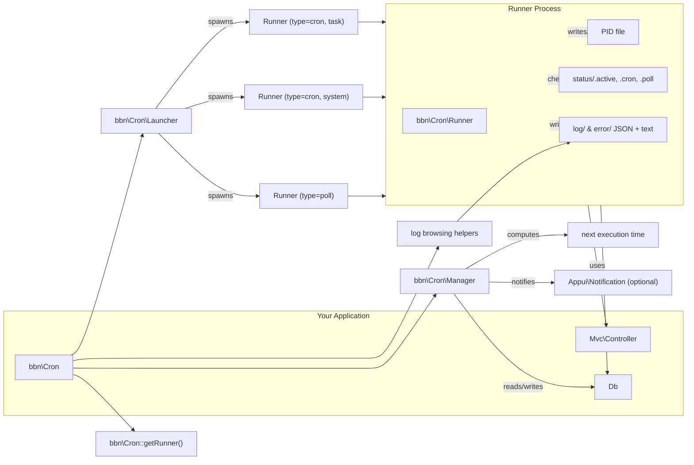

# BBN Cron System  
A lightweight, process-based task scheduler and poller for PHP applications  

The BBN Cron system provides:

- A **database-backed scheduler** for recurring or one-shot tasks  
- A **task runner** that executes MVC routes in isolated processes  
- A **poller** that observes users and dispatches updates  
- A **logging system** with daily/monthly/yearly statistics

It is designed for long-running, reliable background processing in environments where PHP FPM or HTTP workers cannot safely handle periodic tasks.

---

## ✨ Features

- **True parallel execution** using OS-level processes  
- **No daemon dependencies** — pure PHP + database  
- **Self-supervising**: task system and poller automatically relaunch themselves  
- **PID-based locking** to avoid duplicated tasks  
- **Timeout detection** + failure notifications  
- **Structured log storage** (JSON + text logs)  
- **MVC route integration** — tasks run through your existing controller logic  

---

## ⚙️ Architecture Overview

The Cron subsystem is composed of four main classes:

### `bbn\Cron`  
The façade you use to interact with the cron engine.  
Provides access to:

- `Launcher` (spawns background processes)
- `Runner` (executes tasks)
- `Manager` (manages tasks in DB)
- Log browsing helpers

---

### `bbn\Cron\Launcher`
Starts new background PHP processes:

```bash
php -f router.php /appui-cron/run "<json config>" > log 2>&1 &
```

Used for launching:

- The **poller**
- The **task system**
- Individual **cron tasks**

---

### `bbn\Cron\Runner`
The brains of the system.  
A Runner process runs in exactly one of these modes:

- **poll** → observer loop, user update dispatch  
- **cron (system)** → main scheduler loop, finds due jobs and launches them  
- **cron (task)** → executes one specific task and logs it  

Each Runner maintains a PID file and calls a shutdown function to clean up state.

---

### `bbn\Cron\Manager`
Handles all interactions with the database:

- Stores tasks in `bbn_cron` table  
- Computes next execution based on frequency  
- Marks tasks as started/finished  
- Detects timeouts  
- Notifies administrators on failed tasks  

---

## 🧩 Architecture Diagram



---

## 📦 Installation & Requirements

- PHP ≥ 8.4  
- Database supported by BBN Db layer  
- BBN MVC controller system present  
- Ability to spawn OS processes (Linux recommended)  
- Writable cron data directory (e.g. `/data/plugins/appui-cron`)  

---

## 🗄 Database Schema

The Cron system expects a table named (by default) `bbn_cron` with fields:

```sql
id          BINARY(16) PRIMARY KEY
file        VARCHAR(128)   -- MVC route to execute
description TEXT
priority    INT
prev        DATETIME NULL  -- last start time
next        DATETIME NULL  -- next scheduled time
pid         INT NULL       -- active process PID
active      TINYINT(1)
cfg         JSON           -- {"frequency": "h1", "timeout": 300}
notification DATETIME NULL -- when a failure notification was sent
project     BINARY(16) NULL -- optional
```

---

# 🚀 Getting Started

## 1. Initialize the Cron engine

```php
use bbn\Cron;
use bbn\Db;
use bbn\Mvc\Controller;

/** @var Controller $ctrl */
$db    = new Db($yourConnectionInfo);
$cron  = new Cron($db, $ctrl);
```

You can override:

- `data_path`
- `exe_path`
- `log_file`
- `prefix`

via the optional config array.

---

## 2. Register a recurring task

A cron task is simply an MVC route that will be executed automatically.

```php
$manager = $cron->getManager();

$task = $manager->add([
  'file'        => 'my/plugin/cron/my-task',
  'description' => 'My recurring task every hour',
  'priority'    => 5,
  'frequency'   => 'h1',   // every hour
  'timeout'     => 1800,   // seconds
]);

echo "Task ID = " . $task['id'];
```

### Frequency format

The frequency string is 1 letter + amount, e.g.:

| Unit | Meaning         | Example |
|------|-----------------|---------|
| `y`  | years           | `y1`    |
| `m`  | months          | `m2`    |
| `w`  | weeks           | `w1`    |
| `d`  | days            | `d15`    |
| `h`  | hours           | `h6`    |
| `i`  | minutes         | `i30`   |
| `s`  | seconds         | `s10`   |

You also have `bbn\Cron\FrequencyUnit` enum for validation.

---

## 3. Running your scheduled task

Cron tasks run your MVC route:

```php
public function action_my_task(): void
{
  // Your logic here
}
```

The controller is re-routed to that path internally by `Runner::runTask()`.

---

## 4. Start the Cron system

There are two continuously-running background processes:

### 🔁 Poller
Observes events & dispatches user notifications.

```php
$cron->launchPoll();
```

### 🕒 Task System
Executes scheduled tasks when due.

```php
$cron->launchTaskSystem();
```

Each spawns a long-running PHP process and supervises itself.

---

## 5. One-shot task (single execution)

```php
$task = $manager->addSingle(
  'my/plugin/cron/do-once',
  'default',
  priority: 5,
  timeout: 300
);
```

Runs only once, then deactivates.

---

# 📜 Logs

Logs are written under the cron data directory:

```
data/
  log/
    cron/
    tasks/<id>/<YYYY>/<MM>/<DD>.json
  error/
  pid/
  status/
```

Each task write includes:

- Start time
- End time
- Duration
- Path to text output (if any)
- Monthly and yearly aggregations

You can retrieve logs via:

```php
$cron->getLastLogs(['id' => $id], error: false, start: 0, num: 20);

$cron->getDayLogs(['id' => $id, 'day' => '2025-01-12']);
```

---

# ⛔ Timeouts & Failures

If the execution time exceeds the configured `timeout`, the task is marked as failed.

Every minute, the poller calls:

```php
$manager->notifyFailed();
```

This inserts a Notification row (if using `bbn\Appui\Notification`) and updates the record’s `notification` timestamp.

---

# 🧠 Supervisor Logic

When any Runner finishes:

- PID file is removed
- Task's next execution time is computed
- Task system or poller is relaunched automatically (unless disabled)

To disable:

```bash
rm data/status/.active
rm data/status/.cron
rm data/status/.poll
```

---

# 🤝 Concurrency Guarantees

- PID files prevent double execution  
- Stale PIDs are detected using `/proc/<pid>` on Linux  
- Dead processes are cleaned up  
- The Runner shutdown function ensures state correctness  
- Tasks always run in **separate PHP processes** for isolation  

---

# ⚠️ Notes for macOS / non-Linux

Process check uses `/proc/<pid>`, which does **not exist** on macOS or Windows.  
If running outside Linux, you should replace the process-alive detection logic with a pluggable implementation.

---

# 🧩 Enums

### `bbn\Cron\Type`

```php
Type::Poll
Type::Cron
```

### `bbn\Cron\FrequencyUnit`

```php
FrequencyUnit::Hour
FrequencyUnit::Day
// ...
```

### `bbn\Cron\RunResult`

Returned by the modern Runner instead of calling `exit()` internally.

---

# 💡 Example: Full Cron Bootstrap Script

```php
<?php
require __DIR__.'/vendor/autoload.php';


$db    = new Db($cfg);
$ctrl  = new Controller();
$cron  = new Cron($db, $ctrl);

// Start background workers
$cron->launchPoll();
$cron->launchTaskSystem();
```

A real environment typically triggers this from system cron:

```bash
@reboot /usr/bin/php /path/to/bootstrap-cron.php
```

---

# 📝 Final Notes

- The system is production-tested and safe for long-running workloads  
- Supports complex scheduling requirements via the database  
- Plays nicely with the bbn MVC framework — cron tasks are just controller routes  
- Self-healing design means no third-party daemons needed  
